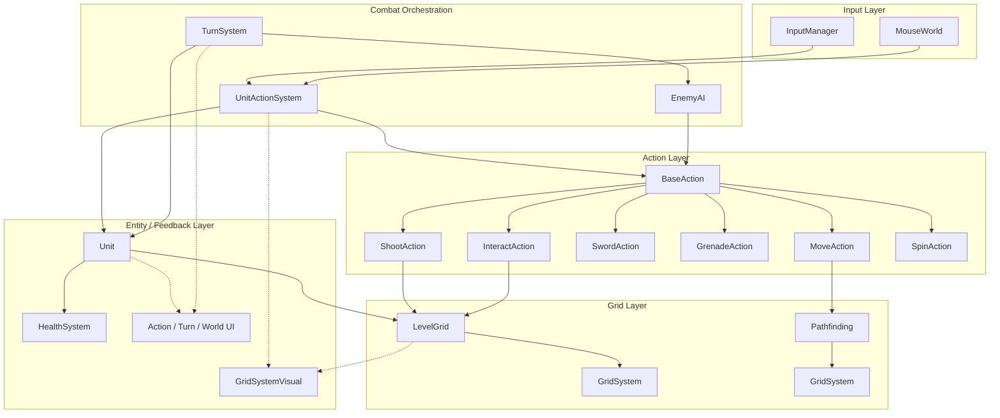
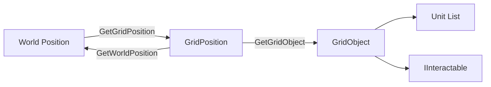
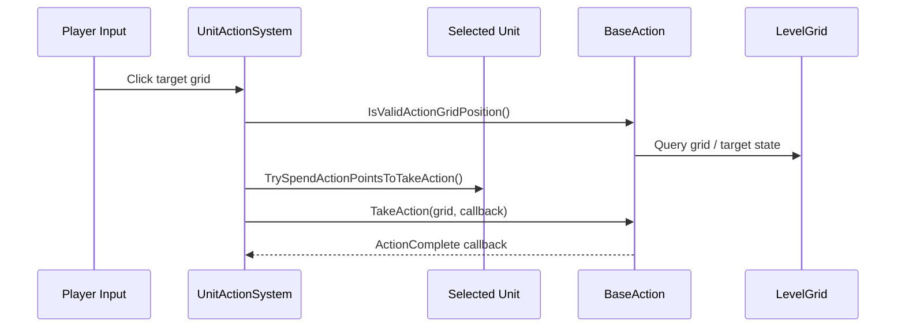
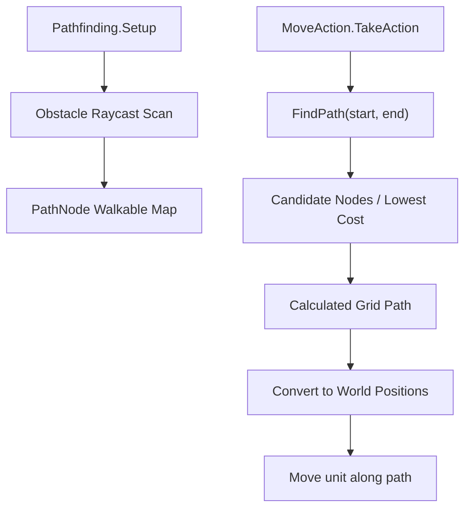
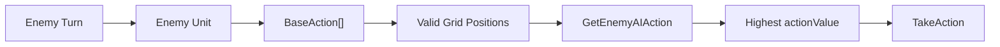

# TBT

> Grid 기반 이동, 액션 선택, 턴 전환, 적 AI를 중심으로 제작한 Unity 턴제 전술 전투 프로토타입입니다.

> 이 저장소는 포트폴리오 공개용 스냅샷입니다. 외부 에셋 팩, 원본 사운드, 원본 애니메이션 바이너리는 재배포 이슈를 피하기 위해 제외하고, 게임플레이 코드와 Unity 프로젝트 구조를 중심으로 정리했습니다.

[GitHub Repository](https://github.com/sharknogal/TBT-original)

> **Last Updated**: 2026.06.08 | **Unity**: 6000.3.3f1 | **Status**: Portfolio Snapshot

---

## 핵심 기술 요약

- **Grid 기반 전술 맵**: `GridSystem<T>`를 기반으로 월드 좌표와 그리드 좌표를 변환하고, 유닛 점유 상태와 상호작용 오브젝트를 관리합니다.
- **모듈형 액션 구조**: `BaseAction`을 상속한 Move, Shoot, Sword, Grenade, Spin, Interact 액션으로 전투 행동을 분리했습니다.
- **Grid 기반 경로 이동**: 장애물 레이어와 노드 이동 가능 여부를 기준으로 이동 가능 칸을 계산하고, 이동 액션에서 실제 경로를 따라 유닛을 이동시킵니다.
- **턴/액션 포인트 시스템**: 플레이어 턴과 적 턴을 전환하며, 각 유닛은 턴 시작 시 액션 포인트를 회복합니다.
- **점수 기반 Enemy AI**: 각 액션이 후보 위치별 가치를 계산하고, 적 AI가 가장 높은 점수의 행동을 선택합니다.
- **시야/사거리 판정**: 사격 액션은 거리, 적/아군 여부, 장애물 Raycast를 함께 검사해 유효 타겟을 필터링합니다.
- **이벤트 기반 UI/피드백**: 선택 유닛, 선택 액션, 행동 시작/종료, 체력 변경, 사망 이벤트를 UI와 연출 시스템이 구독합니다.
- **상호작용/파괴 오브젝트**: 문, 크레이트, 투사체, 폭발, 래그돌 등 전술 전투에 필요한 오브젝트 흐름을 구현했습니다.

---

## 1. 프로젝트 소개

### 1.1 게임 개요

**TBT**는 작은 전술 맵 위에서 유닛을 선택하고, 이동/사격/근접/수류탄/상호작용 액션을 사용해 적을 제압하는 **턴제 전술 전투 프로토타입**입니다.

핵심 목표는 단순한 기능 나열이 아니라, 턴제 전투에서 자주 필요한 구조를 분리해 유지보수와 확장이 가능한 형태로 만드는 것입니다. 유닛은 공통 `BaseAction` 인터페이스를 통해 행동하고, 그리드/턴/AI/UI는 이벤트와 전용 매니저를 통해 연결됩니다.

### 1.2 프로젝트 진행 단계

| 단계 | 상태 | 주요 성과 |
|------|------|-----------|
| **Phase 1: Core Combat** | 완료 | 그리드, 이동, 사격, 근접, 수류탄, 턴 시스템 구현 |
| **Phase 2: Tactical Loop** | 완료 | 적 AI, 액션 포인트, 사거리 시각화, 상호작용 오브젝트 구현 |
| **Phase 3: Portfolio Snapshot** | 진행 | 공개 저장소 정리, 외부 에셋 제외, README 문서화 |
| **Phase 4: Polish** | 예정 | 주석 인코딩 정리, 자체 에셋 대체, 빌드/영상 자료 추가 |

---

## 2. 핵심 기술 및 아키텍처

### 2.0 전체 시스템 아키텍처



**아키텍처 핵심 원칙**

- **Action Polymorphism**: 모든 유닛 행동을 `BaseAction` 기반으로 통일해 UI, 플레이어 입력, Enemy AI가 같은 액션 인터페이스를 사용합니다.
- **Grid-first Gameplay**: 이동, 사거리, 타겟 판정, 상호작용이 모두 `GridPosition`을 기준으로 계산됩니다.
- **Event-driven Feedback**: 선택/이동/사망/턴 변경 이벤트를 통해 UI와 시각화가 게임 로직에 직접 묶이지 않도록 구성했습니다.

---

### 2.1 Grid 기반 위치/점유 관리

| 구분 | 내용 |
|------|------|
| **문제** | 턴제 전투에서는 유닛 위치, 이동 가능 칸, 공격 가능 칸, 상호작용 오브젝트를 월드 좌표만으로 관리하면 판정이 복잡해집니다. |
| **해결** | `GridSystem<T>` 제네릭 클래스로 그리드 데이터를 만들고, `LevelGrid`가 유닛 점유 상태와 상호작용 오브젝트를 중앙에서 관리합니다. |
| **결과** | 액션, AI, UI가 모두 같은 `GridPosition`을 기준으로 동작해 전투 판정 흐름이 단순해졌습니다. |

#### 도식



**핵심 코드**

```csharp
public Vector3 GetWorldPosition(GridPosition gridPosition)
{
    return new Vector3(gridPosition.x, 0, gridPosition.z) * cellSize;
}

public GridPosition GetGridPosition(Vector3 worldPosition)
{
    return new GridPosition(
        Mathf.RoundToInt(worldPosition.x / cellSize),
        Mathf.RoundToInt(worldPosition.z / cellSize)
    );
}
```

---

### 2.2 모듈형 액션 시스템

| 구분 | 내용 |
|------|------|
| **문제** | 이동, 사격, 근접 공격, 수류탄, 상호작용을 한 컨트롤러에 직접 구현하면 입력/AI/UI가 강하게 결합됩니다. |
| **해결** | `BaseAction` 추상 클래스로 액션 이름, 유효 위치 계산, 실행, AP 비용, AI 평가를 공통 인터페이스로 정의했습니다. |
| **결과** | 새로운 액션을 추가할 때 `BaseAction`을 상속하면 플레이어 입력, 버튼 UI, Enemy AI 후보 평가 흐름에 자연스럽게 연결됩니다. |

#### 액션 실행 흐름



**핵심 코드**

```csharp
public abstract class BaseAction : MonoBehaviour
{
    public abstract string GetActionName();
    public abstract void TakeAction(GridPosition gridPosition, Action onActionComplete);
    public abstract List<GridPosition> GetValidActionGridPositionList();
    public abstract EnemyAIAction GetEnemyAIAction(GridPosition gridPosition);

    public virtual int GetActionPointsCost()
    {
        return 1;
    }
}
```

---

### 2.3 Grid 기반 경로 이동 시스템

| 구분 | 내용 |
|------|------|
| **문제** | 단순 거리 기반 이동은 벽, 문, 크레이트 같은 장애물을 우회하지 못합니다. |
| **해결** | `Pathfinding`이 별도의 `GridSystem<PathNode>`를 만들고, 장애물 Raycast로 이동 불가능한 노드를 표시한 뒤 비용 기반으로 이동 경로를 계산합니다. |
| **결과** | `MoveAction`은 최종 목적지만 받더라도 실제 이동 가능한 경로를 따라 부드럽게 이동합니다. |

#### 도식



**핵심 코드**

```csharp
if (!Pathfinding.Instance.HasPath(unitGridPosition, testGridPosition))
{
    continue;
}

if (Pathfinding.Instance.GetPathLength(unitGridPosition, testGridPosition) >
    maxMoveDistance * pathfindingDistanceMultiplier)
{
    continue;
}
```

---

### 2.4 점수 기반 Enemy AI

| 구분 | 내용 |
|------|------|
| **문제** | 적 유닛이 랜덤으로 행동하면 전술 게임의 압박감이 떨어지고, 모든 행동을 하드코딩하면 확장이 어렵습니다. |
| **해결** | 각 액션이 후보 위치별 `EnemyAIAction.actionValue`를 반환하고, `EnemyAI`가 실행 가능한 액션 중 가장 높은 값을 선택합니다. |
| **결과** | 사격, 근접, 이동 같은 액션마다 평가 기준을 다르게 둘 수 있어 액션 추가와 AI 확장이 쉬워졌습니다. |

#### 도식



**핵심 코드**

```csharp
foreach (BaseAction baseAction in enemyUnit.GetBaseActionArray())
{
    if (!enemyUnit.CanSpendActionPointsToTakeAction(baseAction))
    {
        continue;
    }

    EnemyAIAction testEnemyAIAction = baseAction.GetBestEnemyAIAction();
    if (testEnemyAIAction != null && testEnemyAIAction.actionValue > bestEnemyAIAction.actionValue)
    {
        bestEnemyAIAction = testEnemyAIAction;
        bestBaseAction = baseAction;
    }
}
```

---

### 2.5 사거리/타겟 판정과 전투 피드백

| 구분 | 내용 |
|------|------|
| **문제** | 전술 전투에서는 “공격 가능한 대상인지”와 “플레이어가 이해할 수 있는 시각 피드백”이 함께 필요합니다. |
| **해결** | 액션별 유효 칸 계산을 분리하고, `GridSystemVisual`이 선택 액션에 따라 이동/사격/근접/수류탄 범위를 다른 색으로 표시합니다. |
| **결과** | 플레이어는 현재 액션으로 가능한 선택지를 즉시 볼 수 있고, 액션 로직은 UI 표시와 분리됩니다. |

#### ShootAction 판정 기준

- 맵 내부 좌표인지 확인
- 맨해튼 거리 기준 사거리 확인
- 해당 칸에 유닛이 있는지 확인
- 사망한 유닛 제외
- 같은 팀 유닛 제외
- 장애물 Raycast로 시야 차단 여부 확인

```csharp
if (Physics.Raycast(
        unitWorldPosition + Vector3.up * unitShoulderHeight,
        shootDir,
        Vector3.Distance(unitWorldPosition, targetUnit.GetWorldPosition()),
        obstaclesLayerMask))
{
    continue;
}
```

---

## 3. 주요 시스템 구현

### 3.1 유닛 및 액션 포인트 시스템

**시스템 특징**

- 유닛은 `BaseAction[]`을 자동으로 수집해 보유 액션을 관리합니다.
- 턴이 바뀔 때 현재 턴의 진영 유닛만 액션 포인트를 회복합니다.
- 체력이 0이 되면 그리드 점유 상태를 해제하고 사망 이벤트를 발행합니다.
- 선택된 유닛이 사망하면 가장 가까운 아군 유닛을 다시 선택하는 보정 로직이 있습니다.

**주요 컴포넌트**

| 컴포넌트 | 역할 |
|----------|------|
| `Unit` | 유닛 상태, 액션 목록, AP, 팀 구분, 그리드 위치 관리 |
| `HealthSystem` | 체력, 피격, 사망 이벤트 관리 |
| `UnitManager` | 플레이어/적 유닛 목록 관리 |
| `UnitActionSystem` | 선택 유닛, 선택 액션, 입력 실행 흐름 관리 |

---

### 3.2 이동 및 경로 시각화

**시스템 특징**

- `MoveAction`은 계산된 그리드 경로를 받아 월드 좌표 리스트로 변환합니다.
- 유닛은 경로의 각 지점을 순서대로 이동하며 방향을 보간합니다.
- 이동 가능한 칸은 점유 상태, 장애물, 경로 존재 여부, 최대 이동 거리로 필터링됩니다.
- `LevelGrid.OnAnyUnitMovedGridPosition` 이벤트로 그리드 시각화가 자동 갱신됩니다.

**주요 컴포넌트**

| 컴포넌트 | 역할 |
|----------|------|
| `MoveAction` | 이동 가능 칸 계산 및 경로 이동 실행 |
| `Pathfinding` | 그리드 경로 계산 및 장애물 노드 관리 |
| `PathNode` | 이동 비용과 이전 노드 저장 |
| `GridSystemVisual` | 선택 액션의 유효 칸 표시 |

---

### 3.3 사격/근접/수류탄 액션

**시스템 특징**

- `ShootAction`은 조준, 발사, 쿨오프 상태로 나뉘어 시간 기반으로 진행됩니다.
- 사격은 장애물 Raycast를 통해 엄폐물 뒤 대상에게 발사되지 않도록 처리합니다.
- `SwordAction`은 근접 범위 내 적에게 높은 피해를 주는 근접 공격입니다.
- `GrenadeAction`은 지정 위치로 투사체를 생성하고 폭발 완료 콜백으로 액션을 종료합니다.

**주요 컴포넌트**

| 컴포넌트 | 역할 |
|----------|------|
| `ShootAction` | 원거리 타겟 판정, 조준/발사 상태 전환, 피해 처리 |
| `SwordAction` | 근접 타겟 판정, 공격 타이밍, 피해 처리 |
| `GrenadeAction` | 투척 가능 범위 계산, 수류탄 투사체 생성 |
| `BulletProjectile` / `GrenadeProjectile` | 투사체 이동 및 충돌/폭발 처리 |

---

### 3.4 상호작용과 오브젝트 상태 변화

**시스템 특징**

- `IInteractable` 인터페이스로 상호작용 대상의 구현을 분리했습니다.
- `InteractAction`은 주변 그리드에서 상호작용 가능한 오브젝트를 찾습니다.
- 문과 크레이트는 전술 맵에서 이동/시야/공격 흐름에 영향을 주는 오브젝트로 활용됩니다.

**주요 컴포넌트**

| 컴포넌트 | 역할 |
|----------|------|
| `InteractAction` | 인접 상호작용 가능 칸 계산 및 실행 |
| `Door` | 문 열림/닫힘과 상호작용 처리 |
| `DestructibleCrate` | 파괴 가능한 엄폐물 처리 |
| `PathfindingUpdater` | 오브젝트 상태 변화 후 이동 가능성 갱신 |

---

### 3.5 UI 및 피드백 시스템

**시스템 특징**

- 액션 버튼 UI는 현재 선택 유닛이 가진 액션 목록을 기준으로 구성됩니다.
- 선택 액션 변경 시 그리드 표시가 즉시 갱신됩니다.
- 턴 UI는 현재 턴 번호와 플레이어/적 턴 상태를 표시합니다.
- 유닛 월드 UI는 체력 상태를 전투 화면에서 직접 보여줍니다.
- 카메라와 화면 흔들림은 액션 이벤트와 연결되어 전투 피드백을 강화합니다.

**주요 컴포넌트**

| 컴포넌트 | 역할 |
|----------|------|
| `UnitActionSystemUI` | 액션 버튼 목록과 선택 상태 표시 |
| `ActionButtonUI` | 단일 액션 버튼 표시 및 클릭 처리 |
| `TurnSystemUI` | 턴 상태 표시 |
| `UnitWorldUI` | 유닛 체력 UI 표시 |
| `ScreenShake` / `ScreenShakeActions` | 공격 이벤트 기반 카메라 흔들림 |

---

## 4. 개발 환경

### 기술 스택

| 카테고리 | 기술 | 버전 | 목적 |
|----------|------|------|------|
| **엔진** | Unity | 6000.3.3f1 | 3D 턴제 전술 게임 개발 |
| **언어** | C# | Unity C# | 게임플레이 로직 |
| **렌더링** | Universal Render Pipeline | 17.3.0 | 렌더링 파이프라인 |
| **입력** | Unity Input System | 1.17.0 | 마우스/키보드 입력 처리 |
| **카메라** | Cinemachine | 2.10.5 | 카메라 제어 |
| **AI 이동 기반** | AI Navigation | 2.0.9 | Unity 내비게이션 패키지 |
| **버전 관리** | Git/GitHub | - | 포트폴리오 공개 저장소 |

### Unity 패키지

| 패키지 | 용도 |
|--------|------|
| `com.unity.render-pipelines.universal` | URP 렌더링 |
| `com.unity.inputsystem` | 입력 처리 |
| `com.unity.cinemachine` | 카메라 시스템 |
| `com.unity.ai.navigation` | 내비게이션 기능 |
| `com.unity.probuilder` | 레벨/프로토타입 제작 |
| `com.unity.test-framework` | 테스트 프레임워크 |
| `com.unity.ugui` | UI 구현 |
| `com.unity.visualscripting` | Unity Visual Scripting 지원 |

---

## 5. 저장소 구성

```text
Assets/
  Scripts/
    Actions/          # Move, Shoot, Sword, Grenade, Spin, Interact 액션
    Grid/             # GridSystem, GridObject, GridPosition, Grid visual
    UI/               # 액션 버튼, 턴 UI, 월드 UI
    Unit.cs           # 유닛 상태/AP/그리드 점유 관리
    UnitActionSystem.cs
    EnemyAI.cs
    Pathfinding.cs
    TurnSystem.cs
  Prefabs/            # 유닛, 투사체, UI, 전술 오브젝트 프리팹
  Scenes/             # GameScene
Packages/             # Unity 패키지 매니페스트
ProjectSettings/      # Unity 프로젝트 설정
```

---

## 6. 실행 방법

1. Unity Hub에서 Unity `6000.3.3f1` 또는 호환되는 Unity 6 버전으로 프로젝트를 엽니다.
2. `Assets/Scenes/GameScene.unity`를 엽니다.
3. 외부 에셋이 필요한 시각/오디오 리소스는 로컬에서 별도로 복원합니다.
4. Play 버튼으로 전술 전투 프로토타입을 실행합니다.

> 공개 저장소에는 외부 Asset Store 팩, 원본 사운드, 원본 FBX 애니메이션 파일이 포함되어 있지 않습니다. 코드 리뷰와 구조 확인은 가능하지만, 원본 연출을 완전히 재현하려면 로컬 에셋 복원이 필요합니다.

---

## 로드맵

### Short-term

| 우선순위 | 기능 | 목표 |
|:--------:|------|------|
| 높음 | 주석 인코딩 정리 | 깨진 한글 주석을 정리해 코드 가독성 개선 |
| 높음 | 자체/공개 가능 에셋 대체 | 공개 저장소만으로 장면을 더 온전하게 열 수 있도록 리소스 정리 |
| 중간 | 플레이 영상 추가 | GitHub README에서 바로 확인 가능한 전투 흐름 제공 |

### Mid-term

| 우선순위 | 기능 | 목표 |
|:--------:|------|------|
| 높음 | 액션 데이터 분리 | ScriptableObject 기반 액션 수치 관리 |
| 중간 | Enemy AI 고도화 | 엄폐, 거리, 남은 AP, 체력 상태를 반영한 평가식 개선 |
| 중간 | 전투 UX 개선 | 명중 예측, 피해량 미리보기, 선택 취소 흐름 강화 |

### Future

- 세이브/로드
- 스테이지 클리어 조건
- 장비/스킬 성장 요소
- 튜토리얼 및 조작 가이드
- WebGL 또는 Windows 포트폴리오 빌드 배포

---

## 연락처

**GitHub**: [sharknogal](https://github.com/sharknogal)

---

> **TBT**는 턴제 전술 게임의 기본 전투 루프를 구조적으로 구현한 Unity 프로토타입입니다.
> 액션 기반 설계와 Grid 중심 판정을 바탕으로 새로운 액션, 적 행동, 스테이지 규칙을 확장할 수 있도록 구성했습니다.
